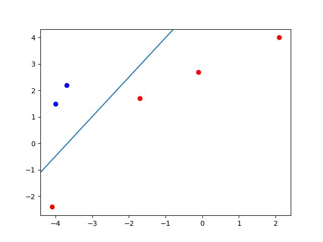

# Лабораторная работа № 1
| Автор                   | Группа   | Вариант |
| ----------------------- | -------- | ------- |
| Волков Матвей Андреевич | М8О-407б | 15      |

## Тема
Персептроны. Процедура обучения Розенблатта.

## Цель работы
Исследование свойств персептрона Розенблатта и его применение
для решения задачи распознавания образов.

## Основные этапы работы
1. Для первой обучающей выборки построить и обучить сеть, которая будет пра-
вильно относить точки к двум классам. Отобразить дискриминантную линию
и проверить качество обучения.
2. Изменить обучающее множество так, чтобы классы стали линейно нераздели-
мыми. Проверить возможности обучения по правилу Розенблатта.
3. Для второй обучающей выборки построить и обучить сеть, которая будет пра-
вильно относить точки к четырем классам. Отобразить дискриминантную ли-
нию и проверить качество обучения.


## Данные 
| Part | Data                                                                               | Labels                                          |
| ---- | ---------------------------------------------------------------------------------- | ----------------------------------------------- |
| 1    | x: -4.1 -1.7 -3.7 -4 -0.1 2.1 <br> y: -2.4 1.7 2.2 1.5 2.7 4                       | 1 1 0 0 1 1                                     |
| 2    | x: 2 −2.3 −4.1 1.9 4.5 −0.7 2.6 −3.2 <br> y: −4.7 −4.6 3.2 −1.9 −4.7 −1.2 2.9 −0.2 | [1,0],[1,1],[0,1],[1,0],[1,0],[1,0],[0,0],[1,1] |

## Исходный код 
### Part 1
Сначала инициализируем персептрон
```python
model = keras.models.Sequential()
model.add(keras.layers.Dense(
    1, # output space
    activation='sigmoid', # Activation function to use
    input_dim=2, # у персептрона 2 входных нейрона
    kernel_initializer=keras.initializers.RandomNormal(stddev=0.5,mean=0.0),
    bias_initializer=keras.initializers.Zeros()
))
```

Будем использовать метрики `mae` и `accuracy`


Таким образом мы рисуем разделяющуюся прямую
```python
def plot_line(a, b, c):
    xlim, ylim = plt.xlim(), plt.ylim()
    plt.axline((-c / a, 0), slope=-a/b)
    plt.xlim(xlim)
    plt.ylim(ylim)
```


### Part 2
Инициализация персептрона 
```python
model = keras.models.Sequential()
model.add(keras.layers.Dense(
    2, # output space
    activation='sigmoid', # Activation function to use
    input_dim=2, # у персептрона 2 входных нейрона
    kernel_initializer=keras.initializers.RandomNormal(stddev=0.5,mean=0.0),
    bias_initializer=keras.initializers.Zeros()
))
```

Метрики


Результат обучения и разделяющие линии


## Вывод
В ходе выполнения первой лабораторной работы я освежил свои знания про перцептрон Розенблата. Данная примитивная сеть помогает понять как работают нейроны в более сложных сетях.
На этапе выполнения работы я столкнулся с трудностями получения правильного ответа, но увеличение количества эпох стало давать мне хороший результат.