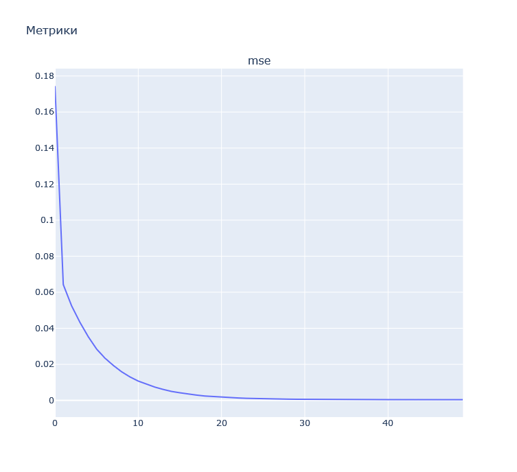
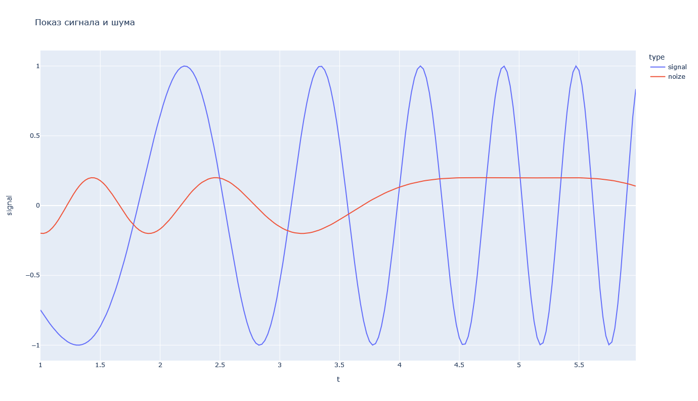
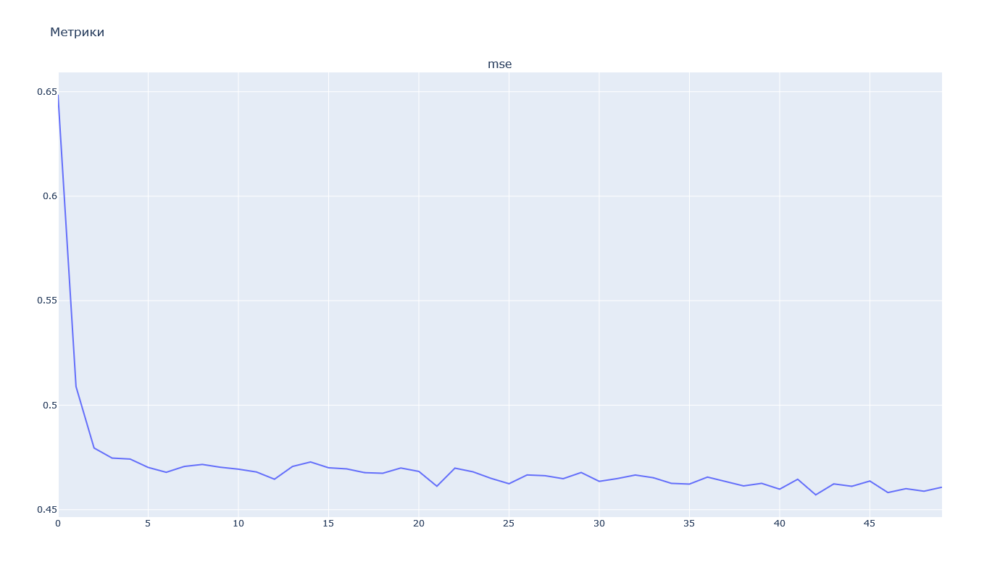
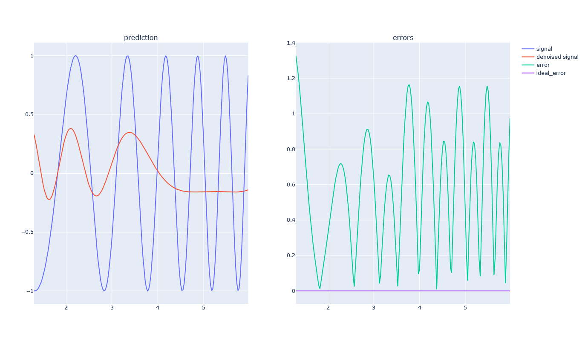

# Лабораторная работа № 2
| Автор                   | Группа   | Вариант |
| ----------------------- | -------- | ------- |
| Волков Матвей Андреевич | М8О-407б | 15      |

## Тема
Линейная нейронная сеть. Правило обучения Уидроу-Хоффа

## Цель работы
Исследование свойств линейной нейронной сети и алгоритмов её обу-
чения, применения сети в задачах аппроксимации и фильтрации.

## Основные этапы работы
1. Использовать линейную нейронную сеть с задержками для аппроксимации функ-
ции. В качестве метода обучения использовать адаптацию.

2. Использовать линейную нейронную сеть в качестве адаптивного фильтра для
подавления помех. Для настройки весовых коэффициентов использовать метод
наименьших квадратов.


## Данные 
### Входные данные
$$x = sin(sin(t)t^3 - 10), \quad t /in [1,3], h = 0.01 $$
$$x = cos(t^2 - 10t + 3), \quad t /in [1,6], h = 0.025 $$

### Выходные данные
$$y = \frac{cos(t^2 -10t + 6)}{5}$$

## Исходный код 
### Part 1
В данной ЛР была использована библиотека pandas и новый визуализатор графиков.

Снипет модели для аппроксимации функции
```python
# configurating model
model = keras.models.Sequential([
    keras.layers.Dense(1, input_dim=window, activation='linear')
])
model.compile(keras.optimizers.SGD(0.01), 'mse', ['mse'])
hist = model.fit(data, target, batch_size=1, epochs=50, verbose=0, shuffle=True)
```

Метрики



Результаты


### Part 2
Инициализация модели для подавления шума
```python
# configurating model
model = keras.models.Sequential([
    keras.layers.Dense(1, input_dim=window, activation='linear')
])
model.compile(keras.optimizers.SGD(0.01), 'mse', ['mse'])
hist = model.fit(data, target, batch_size=1, epochs=50, verbose=0, shuffle=True)
```

Шум и сигнал



Метрики



Результат обучения и показатели ошибки



## Вывод
В ходе выполнения первой лабораторной работы я научился подавлять шум сигнала при помощи элементарного персептрона. Также научился аппроксимировать функцию.