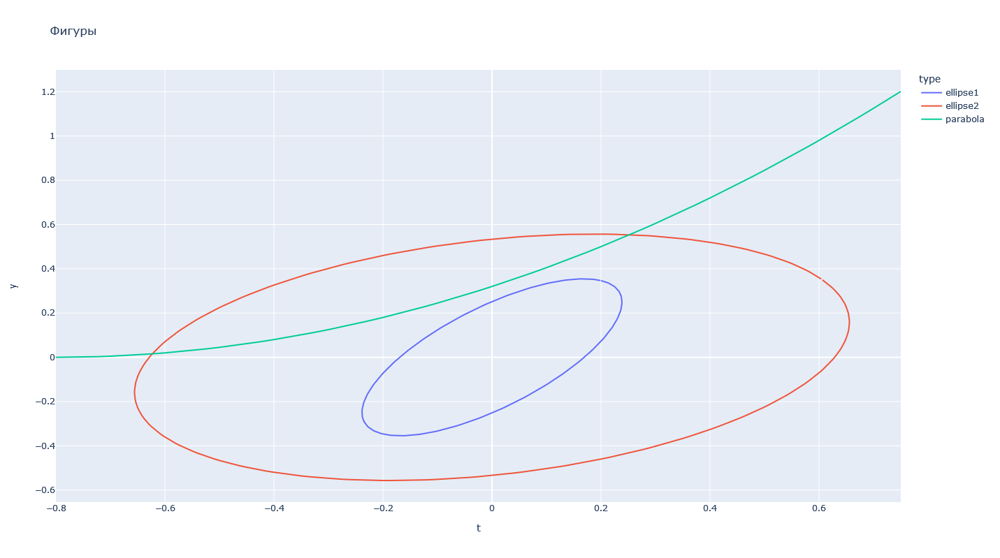
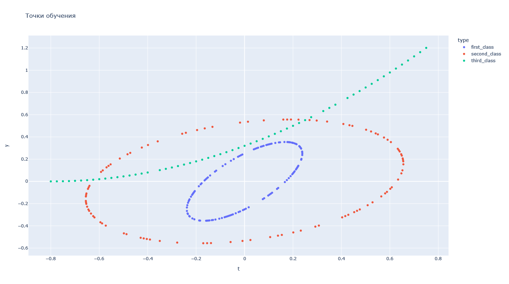
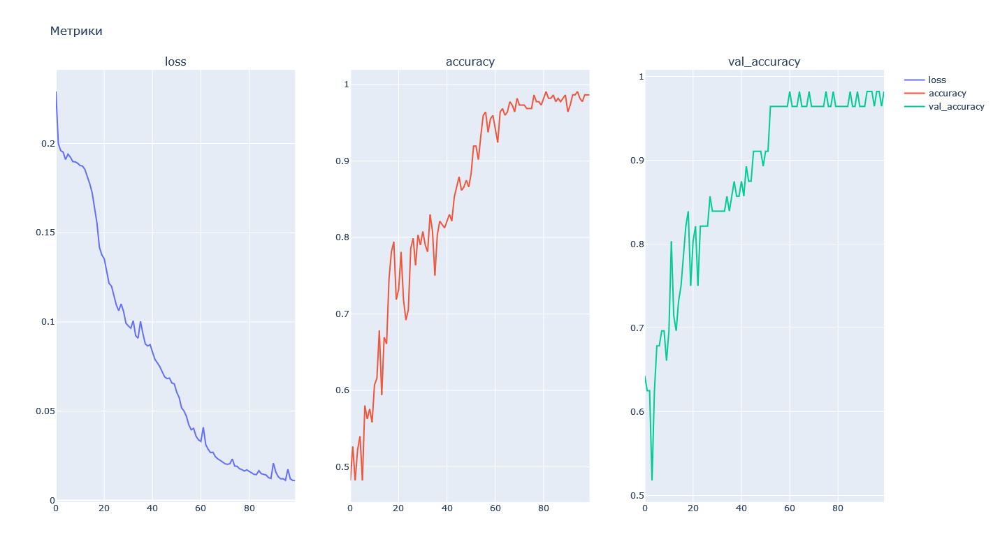
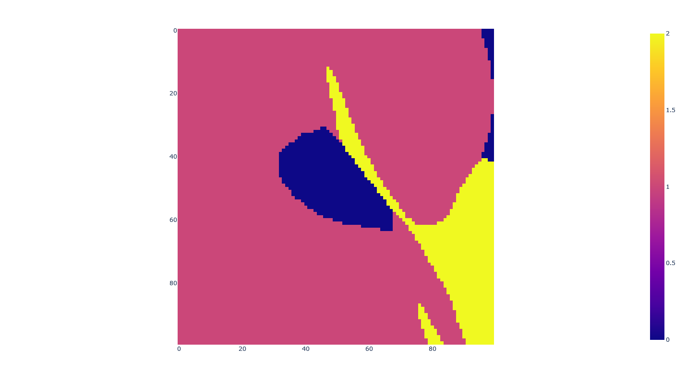
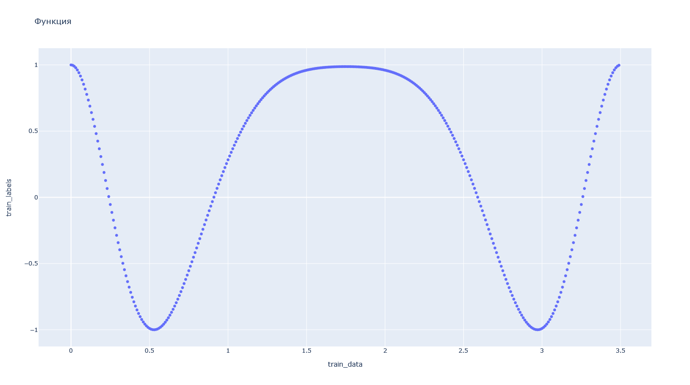
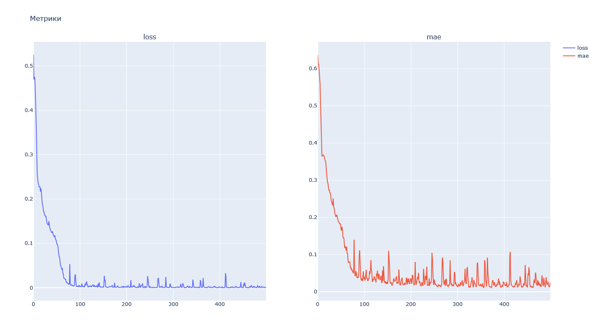
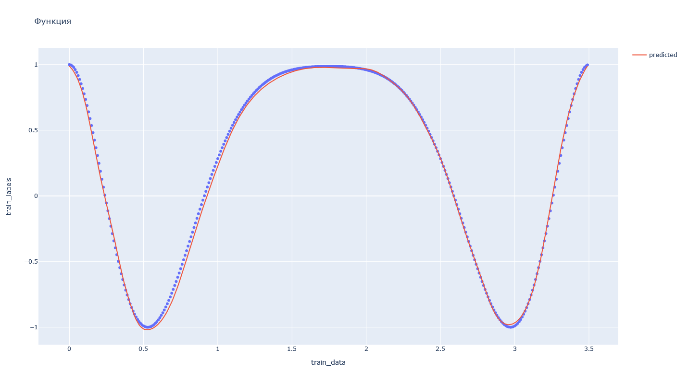

# Лабораторная работа № 3
| Автор                   | Группа   | Вариант |
| ----------------------- | -------- | ------- |
| Волков Матвей Андреевич | М8О-407б | 15      |

## Тема
Многослойные сети. Алгоритм обратного распространения ошибки.

## Цель работы
Исследование свойств многослойной нейронной сети прямого распро-
странения и алгоритмов ее обучения, применение сети в задачах классификации и
аппроксимации функции

## Основные этапы работы
1. Использовать многослойную нейронную сеть для классификации точек в слу-
чае, когда классы не являются линейно разделимыми.

2. Использовать многослойную нейронную сеть для аппроксимации функции.


## Данные 
### Алгебраические линии
Эллипс:   $a = 0.3, b = 0.15, \alpha = \frac{\pi}{6}, x_0 = 0, y_0 = 0$

Эллипс:   $a = 0.7, b = 0.5, \alpha = \frac{\pi}{3}, x_0 = 0, y_0 = 0$

Парабола: $p = 1, \alpha = \frac{\pi}{2}, x_0 = 0, y_0 = -0.8$

## Исходный код 
### Part 1 (Классификация)
В данной лабораторной работе пришлось отрезать четверть точек параболы, чтобы обучение проходило нормально.
Если бы этого не было сделано, то парабола была бы слишком большой относительно эллипсов. Таким образом картинка получилась бы не информативной.

Фигуры



Так четверть точек параболы была отрезана, то точки я взял следующим образом:
```python
data = np.array((*rng.choice(ellipse1, 120, False, axis=0),
                  *rng.choice(ellipse2, 100, False, axis=0),
                  *rng.choice(parabola3, 60, False, axis=0)))
```

Точки для обучения



Снипет модели для классификации функции
```python
# configurating model
model = keras.models.Sequential([
    keras.layers.Dense(20, input_dim=2, activation='tanh'),
    keras.layers.Dense(50, activation='tanh'),
    keras.layers.Dense(3, activation='sigmoid')
])
model.compile(keras.optimizers.Adam(0.01), 'mse', ['accuracy'])
```

Метрики




Результаты



### Part 2 (Аппроксимация)

Снипет модели
```python
# generating model
model = keras.models.Sequential([
    keras.layers.Dense(50, input_dim=1, activation='tanh'),
    keras.layers.Dense(100, activation='tanh'),
    keras.layers.Dense(15, activation='tanh'),
    keras.layers.Dense(1, activation='linear')
])
model.compile(keras.optimizers.Adam(0.001), 'mse', ['mae'])
```

Функция



Метрики




Результаты



## Вывод
В ходе выполнения первой лабораторной работы я научился создавать многослойные нейронные сети, которые использовал в дальнейшем для классификации простейших фигур таких, как эллипс и парабола. Также получилось аппроксимировать функцию, используя все те же многослойные сети.