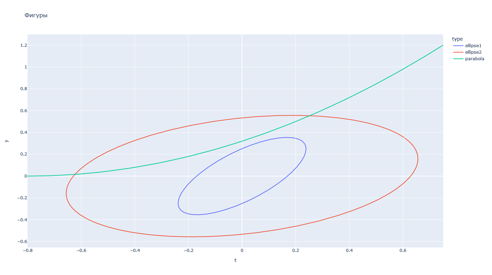
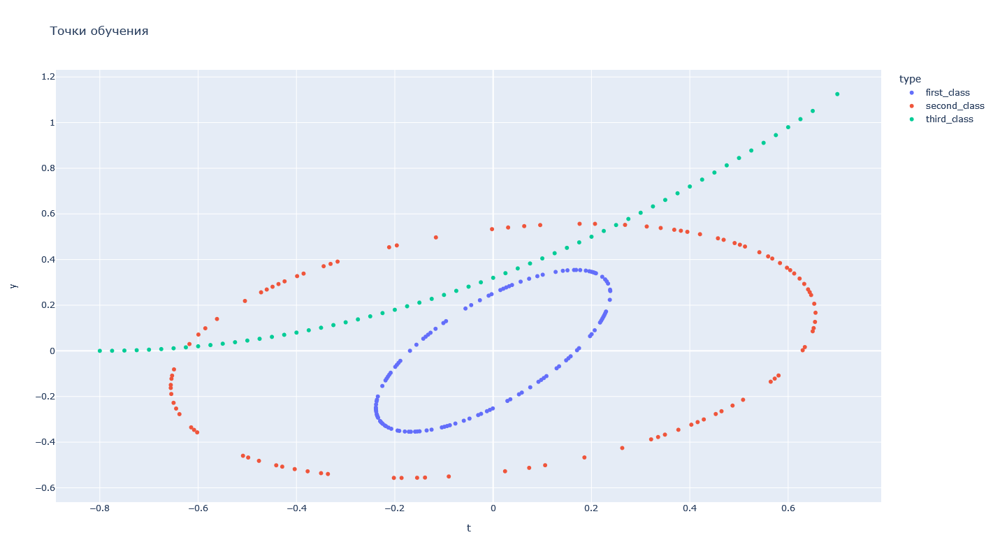
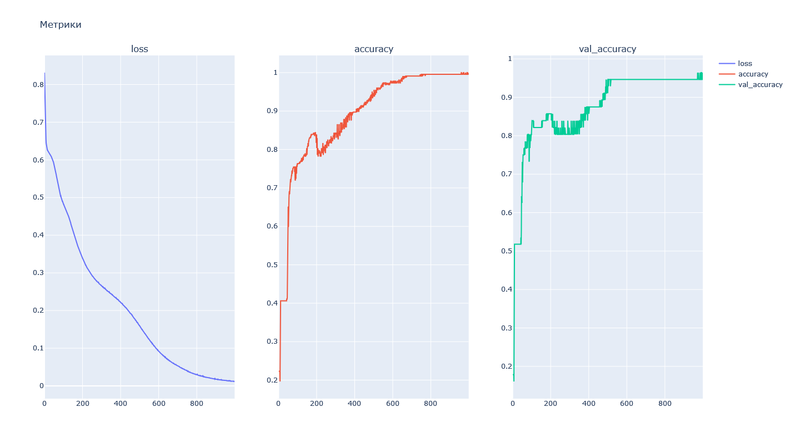
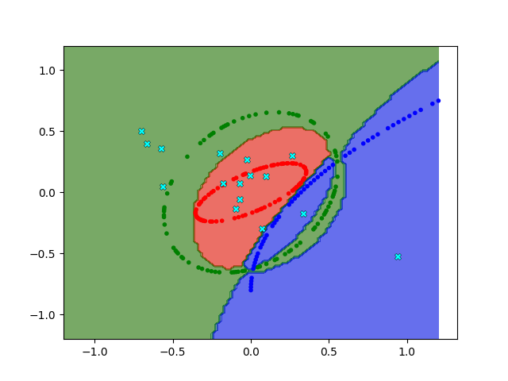
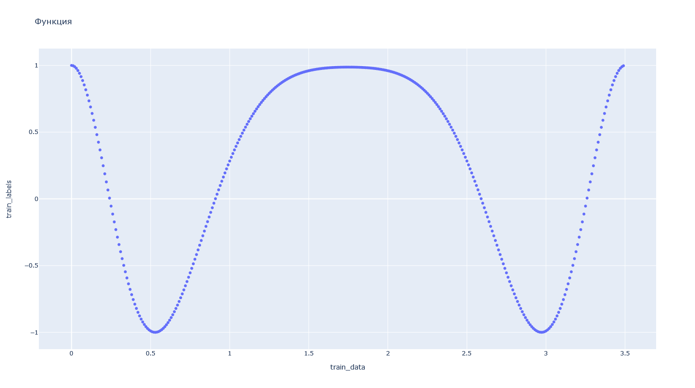
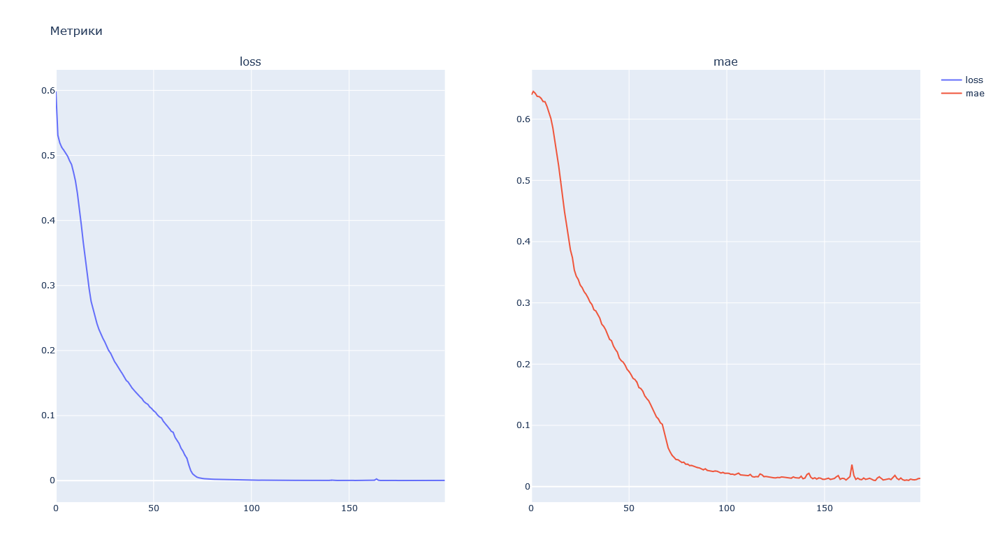
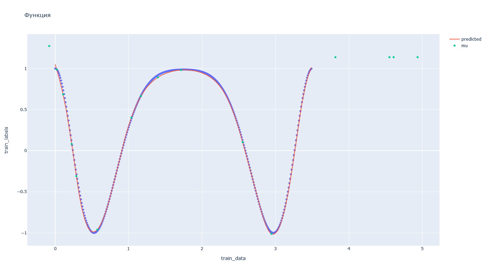

# Лабораторная работа № 4
| Автор                   | Группа   | Вариант |
| ----------------------- | -------- | ------- |
| Волков Матвей Андреевич | М8О-407б | 15      |

## Тема
Сети с радиальными базисными элементами.

## Цель работы
Исследование свойств некоторых видов сетей с радиальными базис-
ными элементами, алгоритмов обучения, а также применение сетей в задачах клас-
сификации и аппроксимации функции.

## Основные этапы работы
1. Использовать сеть с радиальными базисными элементами (RBF) для класси-
фикации точек в случае, когда классы не являются линейно разделимыми.

2. Использовать обобщенно-регрессионную нейронную сеть для аппроксимации
функции.


## Данные 
### Алгебраические линии
Эллипс:   $a = 0.3, b = 0.15, \alpha = \frac{\pi}{6}, x_0 = 0, y_0 = 0$

Эллипс:   $a = 0.7, b = 0.5, \alpha = \frac{\pi}{3}, x_0 = 0, y_0 = 0$

Парабола: $p = 1, \alpha = \frac{\pi}{2}, x_0 = 0, y_0 = -0.8$

## Исходный код 
### Part 1 (Классификация)
В отличии от 3-ей лабораторной работы, был использован особый слой:

```python
class RBFLayer(keras.layers.Layer):
    def __init__(self, output_dim, mu_init='uniform', sigma_init='random_normal', **kwargs):
        self.output_dim = output_dim
        self.mu_init = mu_init
        self.sigma_init = sigma_init
        super(RBFLayer, self).__init__(**kwargs)
        
    def build(self, input_shape):
        self.mu = self.add_weight(name='mu', shape=(input_shape[1], self.output_dim), initializer=self.mu_init, trainable=True)
        self.sigma = self.add_weight(name='sigma', shape=(self.output_dim,), initializer=self.sigma_init, trainable=True)
        super(RBFLayer, self).build(input_shape)
        
    def call(self, inputs):
        diff = backend.expand_dims(inputs) - self.mu
        output = backend.exp(backend.sum(diff ** 2, axis=1) * self.sigma)
        return output
```

Фигуры



Так четверть точек параболы была отрезана, то точки я взял следующим образом:
```python
data = np.array((*rng.choice(ellipse1, 120, False, axis=0),
                  *rng.choice(ellipse2, 100, False, axis=0),
                  *rng.choice(parabola3, 60, False, axis=0)))
```

Точки для обучения



Также стоит заметить, что было добавлено несколько слоев с функцией активации tanh. Также обучение шло не по mse, а по bce

Снипет модели для классификации функции
```python
# configurating model
model = keras.models.Sequential([
    RBFLayer(16, input_dim=2),
    keras.layers.Dense(7, activation='tanh'),
    keras.layers.Dense(16, activation='tanh'),
    keras.layers.Dense(5, activation='tanh'),
    keras.layers.Dense(3, activation='sigmoid')
])
model.compile(keras.optimizers.Adam(3e-4), 'bce', ['accuracy'])

hist = model.fit(train_data, train_labels, validation_data=(test_data, test_labels), batch_size=15, epochs=1000, verbose=0)
```

Метрики




Результаты



### Part 2 (Аппроксимация)

Снипет модели
```python
# generating model
model = keras.models.Sequential([
    RBFLayer(16, input_dim=1, mu_init=keras.initializers.RandomUniform(minval = 0, maxval = 5)),
    keras.layers.Dense(7, activation='tanh'),
    keras.layers.Dense(16, activation='tanh'),
    keras.layers.Dense(4, activation='tanh'),
    keras.layers.Dense(1, activation='linear')
])
model.compile(keras.optimizers.Adam(3e-4), 'mse', ['mae'])

hist = model.fit(train_data, train_labels, batch_size=7, epochs=200, verbose=0, shuffle=True)
```

Функция



Метрики




Результаты



## Вывод
В ходе выполнения первой лабораторной работы я научился создавать многослойные нейронные сети с радиальными базисными элементами, которые использовал в дальнейшем для классификации простейших фигур таких, как эллипс и парабола. Также получилось аппроксимировать функцию, используя все те же многослойные сети. 

В среднем итоги обучения получились лучше, чем в 3-ей лабораторной работе. Хотя сложно наверняка понять это, но обучение явно происходило проще и быстрее.

Также в ходе этой лабораторной работы я выяснил, что мой вариант классификации очень сложно обучить правильно, так парабола пересекает эллипс. Здесь может быть несколько правильных ответов в зависимости от того, как поставлена задача. Я решил, что красивиее всего обогнуть зеленый элипс вокруг, поэтому были применены некоторые модификации сетей с прошлой работы.