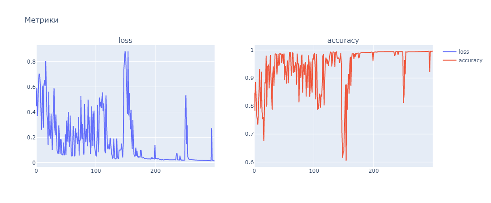

# Лабораторная работа № 5
| Автор                   | Группа   | Вариант |
| ----------------------- | -------- | ------- |
| Волков Матвей Андреевич | М8О-407б | 15      |

## Тема
Сети с обратными связями.

## Цель работы
исследование свойств сетей Хопфилда и Элмана, алгоритмов обуче-
ния, а также применение сетей в задачах распознавания статических и динамических
образов.

## Основные этапы работы
1. Использовать сеть Элмана для распознавания динамических образов. Прове-
рить качество распознавания.

2. Использовать сеть Хопфилда для распознавания статических образов. Прове-
рить качество распознавания.


## Данные 
### Динамический образ

$$g(k) = cos(-2k^2 + 7k), k \in [0.92,3.25]. \text{Длительность} p_1(k): [0,4,2]$$

### Статический образ
Цифры: [2,4,9]

## Исходный код 
### Part 1 (Динамический образ)

По условию мне дан для обучения данная картина


Так у меня выглядит сеть Эльмана

```python
class ElmanLayer(nn.Module):
    def __init__(self, in_features, out_features):
        super(ElmanLayer, self).__init__()
        self.in_features = in_features
        self.out_features = out_features
        self.w1 = nn.Parameter(torch.randn(in_features, out_features))
        self.w2 = nn.Parameter(torch.randn(out_features, out_features))
        self.b = nn.Parameter(torch.randn(out_features))
        self.prev = torch.zeros(out_features)
        
    def clear_memory(self):
        self.prev = torch.zeros(self.out_features)
        
    def forward(self, input):
        out = input @ self.w1 + self.b + self.prev @ self.w2
        out = torch.tanh(out)
        self.prev = out.clone().detach()
        return out
```

Вот код с обучением 

```python
epochs = 210
optim = torch.optim.Adam(elman.parameters(), lr=1e-4)
crit = nn.MSELoss()
history = defaultdict(list)
elman.train()
for epoch in tqdm(range(epochs), desc='Epochs', ncols=70):
    losses = []
    epoch_correct = 0
    epoch_all = 0
    elman[0].clear_memory()
    for x_batch, y_batch in dataloader:
        out = elman(x_batch)
        pred = (out > 0).type(torch.long) * 2 - 1
        loss = crit(out, y_batch)
        
        optim.zero_grad()
        loss.backward()
        optim.step()
        
        losses.append(loss.item())
        epoch_correct += (pred == y_batch).sum().item()
        epoch_all += len(x_batch) * window
    
    history['accuracy'].append(epoch_correct / epoch_all)
    history['loss'].append(np.mean(losses))
```

Метрики обучения



После обучения получилось такая картина


Видно, что буквально на окно, которое я задал в своей программе ответ отстает. Это связано с тем, что сеть просто не успевает понять функцию. Ей для понимание нужно примерно пространство окна, которое было задано для обучения

### Part 2 (Статический образ)

Сеть Хопфилда 

```python
class HopfieldLayer(nn.Module):
    def __init__(self, in_features):
        super(HopfieldLayer, self).__init__()
        self.w = nn.Parameter(torch.zeros(in_features, in_features))
        self.b = nn.Parameter(torch.zeros(in_features))
        self.prev = torch.zeros(in_features)
        
    def set_initial_value(self, value):
        self.prev = value.detach().clone()
        
    def forward(self, input=0):
        out = torch.matmul(self.prev, self.w)
        out = torch.add(out, self.b)
        out = torch.clamp(out, min=-1, max=1)
        self.prev = out.detach().clone()
        return out
```

Я нарисовал для обучения вот такие цифры


Снипет обучения
```python
epochs = 10000
optim = torch.optim.Adam(hopfield.parameters(), lr=1e-5)
crit = nn.MSELoss()
history = defaultdict(list)
hopfield.train()

for epoch in tqdm(range(epochs), desc='Epochs', ncols=70):
    for img in dataloader:
        losses = []
        hopfield.set_initial_value(img)
        out = hopfield()
        loss = crit(out, img)

        optim.zero_grad()
        loss.backward()
        optim.step()

        losses.append(loss.item())

        history['loss'].append(np.mean(losses))
```

Я заметил, что обучение проходило очень плохо и распознавание цифр было плохое. Проблему решило большое количество эпох обучения. Такое обучение свлось почти к нулевому loss. 

Метрики


Результаты


## Вывод
В ходе выполнения лабораторной работы я познакомился рекуррентными сетями. За счет использования информации о предыдущем состоянии, рекуррентные сети могут распознавать сложные динамические образы силами одного линейного слоя или использоваться в качестве автоассоциативной памяти. Также заметно, что для таких сетей нужно большое количество эпох обучения, чтобы хорошо себя проявить