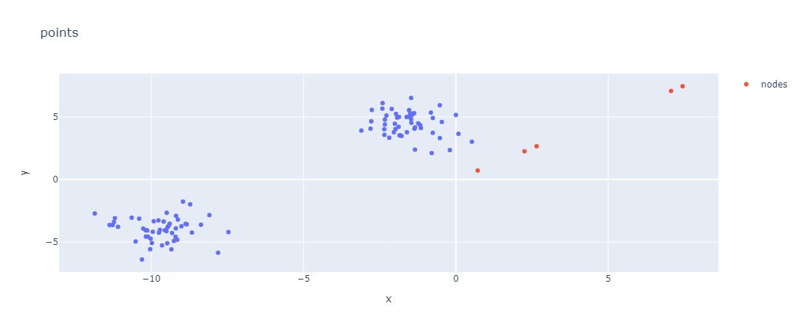
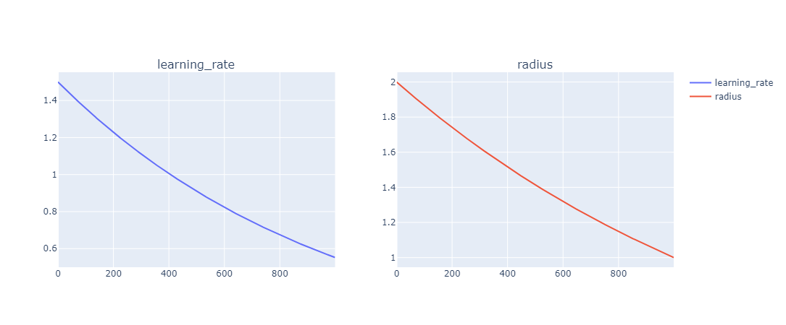

# Лабораторная работа № 6
| Автор                   | Группа   | Вариант |
| ----------------------- | -------- | ------- |
| Волков Матвей Андреевич | М8О-407б | 15      |

## Тема
Сети Кохонена

## Цель работы
исследование свойств слоя Кохонена, карты Кохонена, алгоритмов
обучения, а также применение сетей в задачах кластеризации и классификации.

## Основные этапы работы
1. Использовать слой Кохонена для выполнения кластеризации множества точек.
Проверить качество разбиения.

2. Использовать карту Кохонена для выполнения кластеризации множества то-
чек.

3. Использовать карту Кохонена для нахождения одного из решений задачи ком-
мивояжера.

## Исходный код 

Реализация сети

```python
class Kohonen:
    def __init__(self, dim, nodes_count, lr, nodes = None, r = None):
         self.dim = dim
         self.lr = lr
         self.nodes_count = nodes_count
         
         if r is None:
            self.r = int(nodes_count / 2)
         else:
             self.r = r
         self.nodes = (nodes.copy() if nodes is not None else np.random.rand(nodes_count, dim))


    def fit(self, data, epochs):


        self.masr = []
        self.maslr = []
        
        rcpy = self.r
        lrcpy = self.lr

        for e in range(epochs):
            self.masr.append(self.r)
            self.maslr.append(self.lr)

            np.random.shuffle(data)
            for i in range(len(data)):

                min_dist = np.sqrt(np.sum((data[i] - self.nodes[0]) ** 2))
                index_min_node = 0

                for j in range(self.nodes_count):
                        dist = np.sqrt(np.sum((data[i] - self.nodes[j]) ** 2))
                        if (min_dist > dist):
                            min_dist = dist
                            index_min_node = j

                

                for j in range(self.nodes_count):

                    dist = np.sqrt(np.sum((self.nodes[index_min_node] - self.nodes[j]) ** 2))
                    if  dist < self.r:
                        self.nodes[j] += self.lr * np.exp(- dist / (2 * self.r)) * (- self.nodes[j] + data[i])
            
            self.lr = max(0.01, lrcpy * np.exp(-(e + 1) / epochs))
            self.r = rcpy * np.exp(- (e + 1) * np.log(rcpy) / epochs)

        self.masr = np.array(self.masr)
        self.maslr = np.array(self.maslr)
```

Я решил в данной лабораторной работе применить разные типы точек: равномерно распределенные и точки, которые явно образуют точки.

### Равномерно распределенные точки


### Кучки точек






## Вывод
В ходе выполнения лабораторной работы я познакомился c картами Кохонена. Также сравнил как данная простая сеть справится с точками, которые равномерно распределены по пространству. Легко заметить и догодаться, что хорошего результата не получилось, хотя точкам и получилось переместить в небольшое скопление