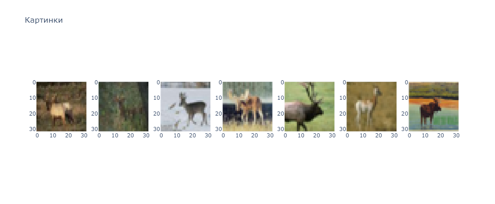
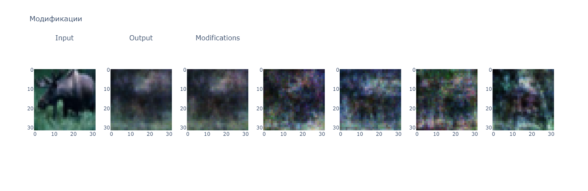
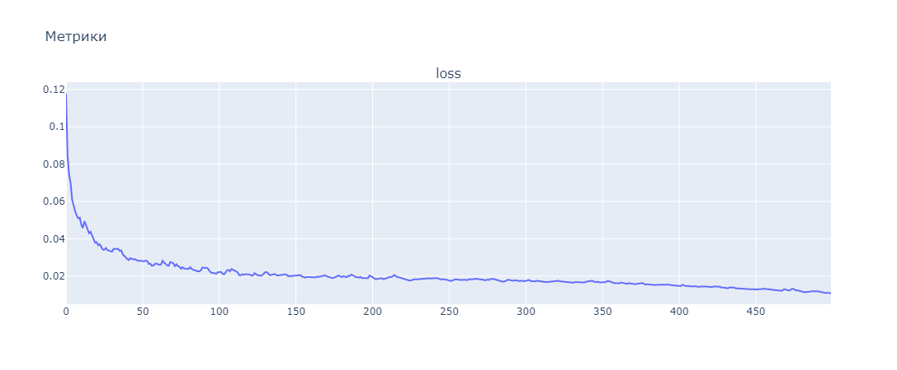
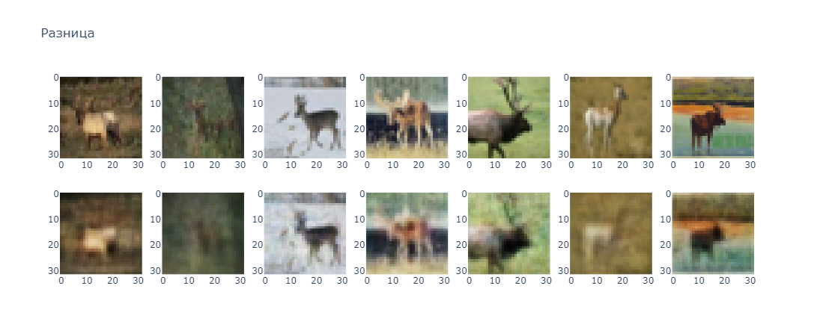
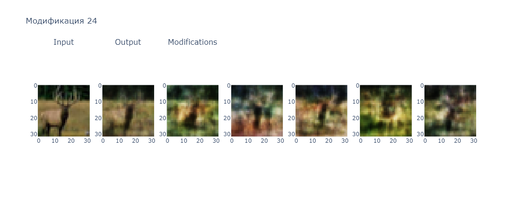

# Лабораторная работа № 7
| Автор                   | Группа   | Вариант |
| ----------------------- | -------- | ------- |
| Волков Матвей Андреевич | М8О-407б | 15      |

## Тема
Автоассоциативные сети с узким горлом

## Цель работы
Исследование свойств автоассоциативных сетей с узким горлом, олгоритмов обучения, а также применения сетей дя выполнения линейного и нелинейного анализа главных компонент набора данных.

## Основные этапы работы
1. Использовать автоассоциативную сеть с узким горлом для отображения набора данных, выделяя первую главную компоненту данных.

2. Использовать автоассоциативную сеть с узким горлом для модификации иллюстрации, пытаясь ее превратить во что-то, похожее на объект исследования

## Данные
Картинки класса "Олени"

## Исходный код 

В данной лабораторной работе нам было предложено использовать для обучения датасет с картинками разных классов. По варианту мне досталось обучение на оленях.

Выделим первые несколько картинок из датасета



Далее расширим обучающий фреймворк


```python
def fit(model, optim, crit, epochs, data):
    model.train()
    history = defaultdict(list)
    pbar = tqdm.trange(epochs, ascii=True)
    for i in pbar:
        avg_loss = 0
        for batch in data:
            batch = batch.to(device)
            
            optim.zero_grad()
            
            output = model(batch)
            loss = crit(batch, output)
            loss.backward()
            
            optim.step()
            avg_loss += loss.item() / len(data)
        history["loss"].append(avg_loss)
        pbar.set_description(f'Loss: {avg_loss:.8f}')
    
    with torch.no_grad():
        torch.cuda.empty_cache()
    return history
```

Далее построим энкодер и декодер. Было реализовано, на самом деле, 3 сети. Они были все линейные.
Первая была обычная и достаточно простая

```python
encoder = nn.Sequential(
    nn.Linear(3072, 1024),
    nn.Tanh(),
    nn.Linear(1024, 96),
    nn.Tanh()
)

decoder = nn.Sequential(
    nn.Linear(96, 1024*1),
    nn.Tanh(),
    nn.Linear(1024, 3072),
    nn.Tanh()
)
```
У нее получалось хорошо копировать картинки и плохо модифицировать их

Далее сеть я решил нарочно испортить, так как осознал, что возможно чем лучше сеть копирует, тем хуже ей получается модифицировать.

Получилось что-то такое

```python
encoder = nn.Sequential(
    nn.Linear(3072, 1024*4),
    nn.Tanh(),
    nn.Linear(1024*4, 96),
    nn.Tanh()
)

decoder = nn.Sequential(
    nn.Linear(96, 1024*4),
    nn.Tanh(),
    nn.Linear(1024*4, 3072),
    nn.Tanh()
)
```
Эта модель очень плохо копировала объект, но в то же время выдавала какие-то модификации. На них всех получались стремные существа. Например на результате ниже на последней картинке получился какой-то здоровый паук



Далее модель я решил сделать следующим образом

```python
encoder = nn.Sequential(
    nn.Linear(3072, 1024*10),
    nn.Tanh(),
    nn.Linear(1024*10, 1024*4),
    nn.Tanh(),
    nn.Linear(1024*4, 1024*2),
    nn.Tanh(),
    nn.Linear(1024*2, 1024*1),
    nn.Tanh(),
    nn.Linear(1024*1, 96),
    nn.Tanh()
)

decoder = nn.Sequential(
    nn.Linear(96, 1024*1),
    nn.Tanh(),
    nn.Linear(1024*1, 1024*2),
    nn.Tanh(),
    nn.Linear(1024*2, 1024*4),
    nn.Tanh(),
    nn.Linear(1024*4, 1024*10),
    nn.Tanh(),
    nn.Linear(1024*10, 3072),
    nn.Tanh()
)
```

Этой моделью получилось поймать баланс между модификациями и копированием

Обучалась она медленно. Было использовано всего 500 эпох обучения



Получились такие результаты копирования



И такие модификации



Можно увидеть на 1 фотке модификации и последней силуэты оленя

## Вывод
В ходе выполнения лабораторной работы я познакомился c автоассоциативными сетями с узким горлом. Также в этой работе были проведены создания новых картинок на базе имеющихся. Данная сеть хорошо бы справилась с картинками побольше, при условии, что в энкодере и декодере бы использовались сверточные сети. Также хочется отметить, что для успешной модификации картинки, прослеживается тенденция того, что сеть не способна хорошо модифицировать фотографии, умея при этом их хорошо копировать и наоборот.