# Лабораторная работа № 8
| Автор                   | Группа   | Вариант |
| ----------------------- | -------- | ------- |
| Волков Матвей Андреевич | М8О-407б | 15      |

## Тема
Динамические сети.

## Цель работы
Исследование свойств некоторых динамических нейронных сетей, алгоритмов обучения, а также применение сетей в задачах аппроксимации функций и распознавания динамических образов.

## Основные этапы работы
1. Использовать нелинейную авторегрессионную сеть с внешними входами для аппроксимации траектории динамической системы и выполнения многошагового прогноза.

## Данные
$$ u(k) = \frac{sin(k^2 - 6k - 2\pi)}{4} $$

## Исходный код 

### Код сети NARX

```python
class NARX(nn.Module):
    def __init__(self, in_features, hid_features, out_features, in_delay, out_delay):
        super(NARX, self).__init__()        
        self.in_tdl = TDL(in_features, in_delay)
        self.out_tdl = TDL(out_features, out_delay)
        
        self.w1 = nn.Parameter(torch.randn(in_features, hid_features))
        self.b1 = nn.Parameter(torch.zeros(hid_features))
        
        self.w2 = nn.Parameter(torch.randn(out_features, hid_features))
        
        self.w3 = nn.Parameter(torch.randn(hid_features, out_features))
        self.b3 = nn.Parameter(torch.zeros(out_features))
        
    def clear(self):
        self.in_tdl.clear()
        self.out_tdl.clear()
        
    def forward(self, x):
        out = torch.tanh(self.in_tdl() @ self.w1 + self.b1 + self.out_tdl() @ self.w2)
        out = out @ self.w3 + self.b3
        
        self.in_tdl.push(x.detach().clone())
        self.out_tdl.push(out.detach().clone())
        return out

class TDL(nn.Module):
    def __init__(self, in_features, delays):
        super(TDL, self).__init__()
        self.in_features = in_features
        self.delays = delays
        self.line = deque()
        self.clear()
        
    def clear(self):
        self.line.clear()
        for _ in range(self.delays):
            self.line.append(torch.zeros(1, self.in_features))
    
    def push(self, x):
        self.line.appendleft(x)
    
    def forward(self):
        return self.line.pop()
```

### График входящих функций

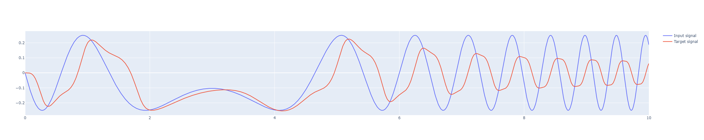

В данной лабораторной работе мне не очень сильно повезло с вариантом функции. 
Все потому, что функция очень чувствительна к конфигурации сети.

На примере разных конфигурация я это сейчас продемонстрирую

### Конфигурация 1


```python
window = 8
train_data = [(np.array(u[i:i + window], dtype=np.float32), np.array(y[i:i + window], dtype=np.float32)) for i in range(len(k) - window + 1)]
train_loader = DataLoader(train_data, batch_size=1, shuffle=False)

model = NARX(window, 10, window, 2, 3)
hist = fit(model, torch.optim.Adam(model.parameters(), lr=1e-4), nn.MSELoss(), 60, train_loader)
```

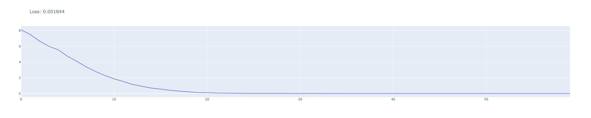

Данная конфигурация является одной из самых лучших, что мне получилось добиться.

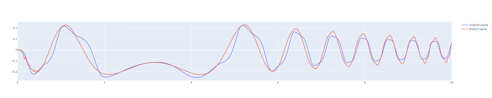

Не смотря на все ее недостатки, сейчас покажу что может случиться с результатом, если совсем немного подвинуть конфигурации сети

### Конфигурация 2

```python
window = 9
train_data = [(np.array(u[i:i + window], dtype=np.float32), np.array(y[i:i + window], dtype=np.float32)) for i in range(len(k) - window + 1)]
train_loader = DataLoader(train_data, batch_size=1, shuffle=False)

model = NARX(window, 15, window, 3, 2)
hist = fit(model, torch.optim.Adam(model.parameters(), lr=1e-4), nn.MSELoss(), 70, train_loader)
```

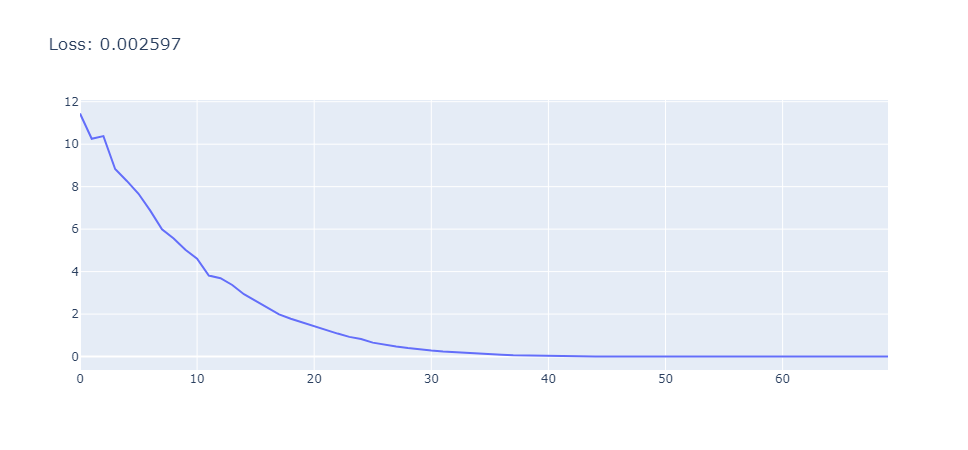

Результат хоть и есть, но невооруженным глазом видно, что ошибка тут очень большая


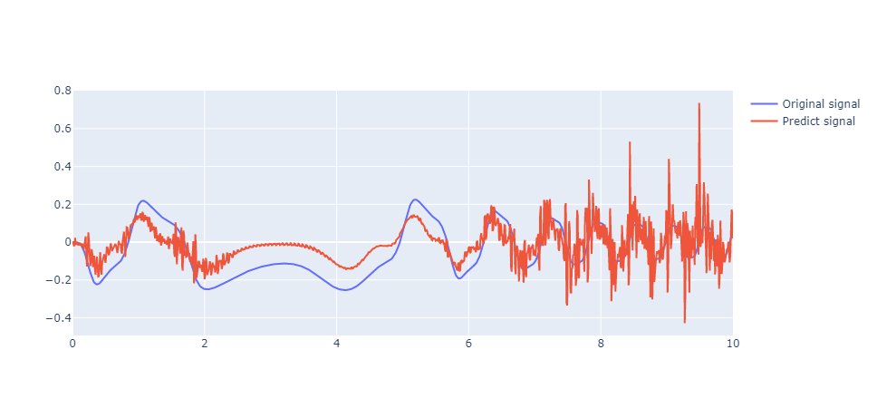

### Конфигурация 3

Давайте теперь посмотрим как может сеть, сделав еще меньше изменений конфигурации по сравнению со второй версией

```python
window = 9
train_data = [(np.array(u[i:i + window], dtype=np.float32), np.array(y[i:i + window], dtype=np.float32)) for i in range(len(k) - window + 1)]
train_loader = DataLoader(train_data, batch_size=1, shuffle=False)

model = NARX(window, 14, window, 3, 2)
hist = fit(model, torch.optim.Adam(model.parameters(), lr=1e-3), nn.MSELoss(), 100, train_loader)
```

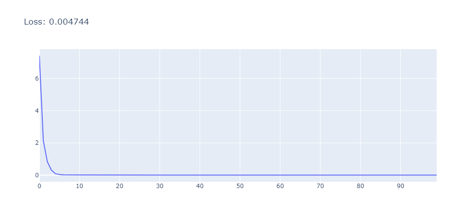

В отличии от предыдущих результатов, тут его нет совсем


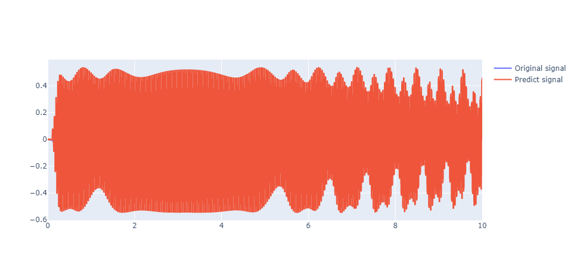

### Конфигурация 4

В данной конфигурации я подумал, что возможно дело такого неаккуратного результата в том, что я беру очень большое обучающее окно.

Давайте посмотрим какой результат будет, если уменьшить окно обучения в 3 раза

```python
window = 3
train_data = [(np.array(u[i:i + window], dtype=np.float32), np.array(y[i:i + window], dtype=np.float32)) for i in range(len(k) - window + 1)]
train_loader = DataLoader(train_data, batch_size=1, shuffle=False)

model = NARX(window, 20, window, 2, 2)
hist = fit(model, torch.optim.Adam(model.parameters(), lr=1e-3), nn.MSELoss(), 50, train_loader)
```
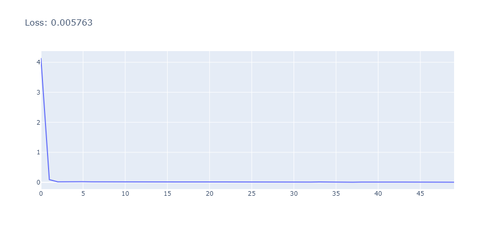

Получилось не так плохо, как в предыдущей конфигурации, но первый вариант все еще лучше

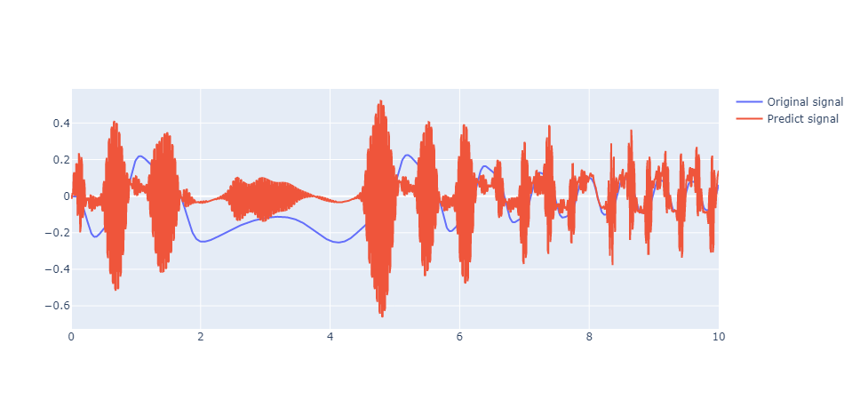

### Конфигурация 5

В данной конфигурации я попытался улучшить результат самой первой конфигурации сети, путем уменьшения лосса.

```python
window = 8
train_data = [(np.array(u[i:i + window], dtype=np.float32), np.array(y[i:i + window], dtype=np.float32)) for i in range(len(k) - window + 1)]
train_loader = DataLoader(train_data, batch_size=1, shuffle=False)

model = NARX(window, 10, window, 2, 3)
hist = fit(model, torch.optim.Adam(model.parameters(), lr=1e-5), nn.MSELoss(), 800, train_loader)
```
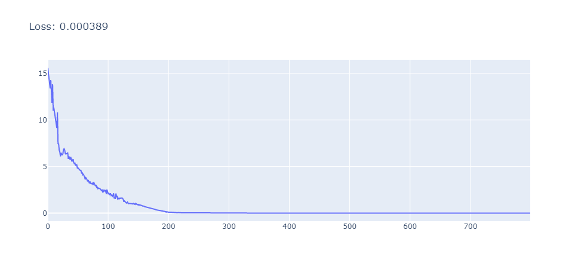

Приличное уменьшение лосса и приличное время обучения модели смогли только ухудшить результат

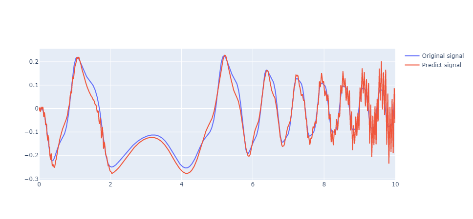


## Вывод
В ходе выполнения лабораторной работы я познакомился с динамической сетью NARX. Эта сеть очень похожа на рекуррентные сети, которые рассматривались в пятой лабораторной работе, но обладает большей памятью, что должно улучшить ее способности к аппроксимации. 

Но на примере моего варианта не трудно заметить, что данная сеть очень чувствительна к входным данным. Из-за чего добиться хорошого результата возможно путем очень долгого подбора нужных параметров сети